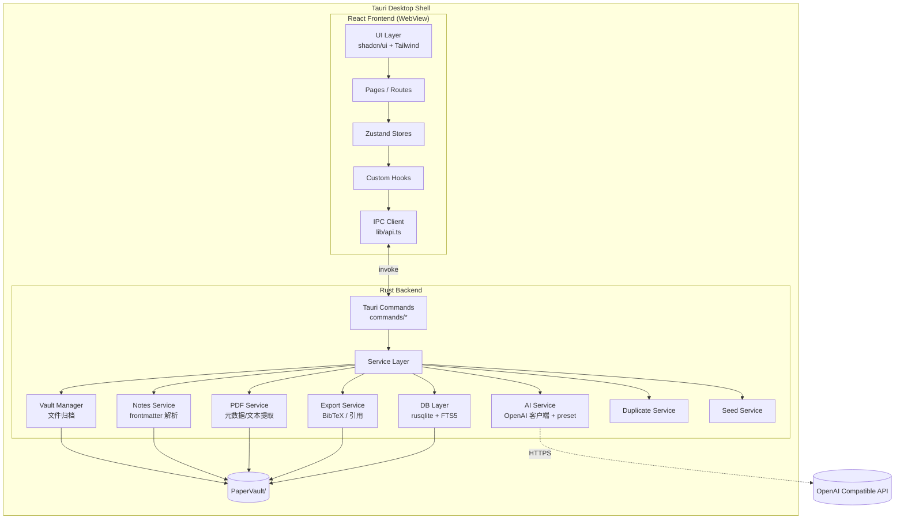
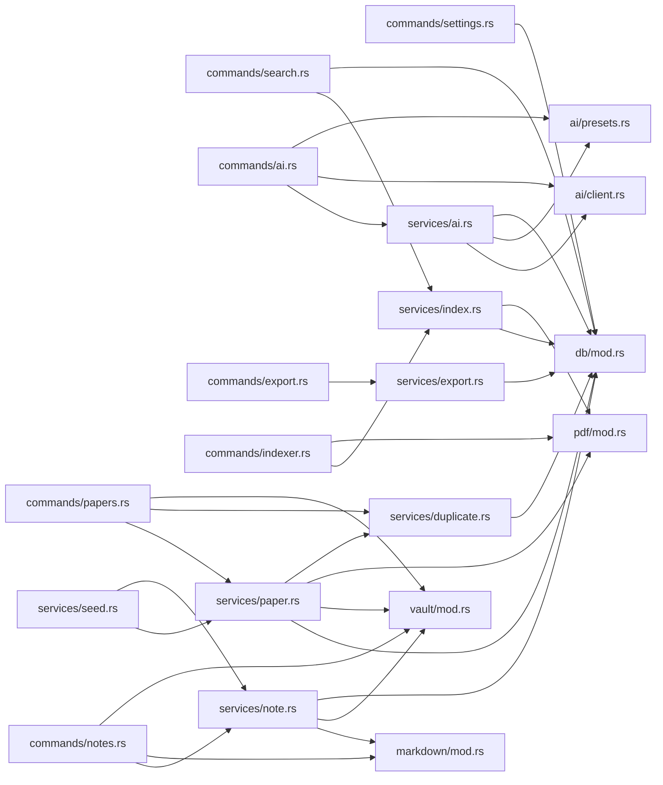
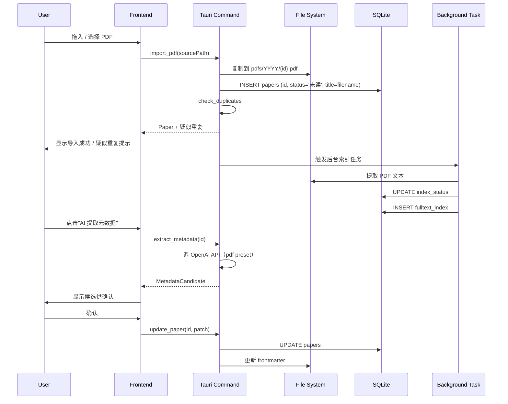
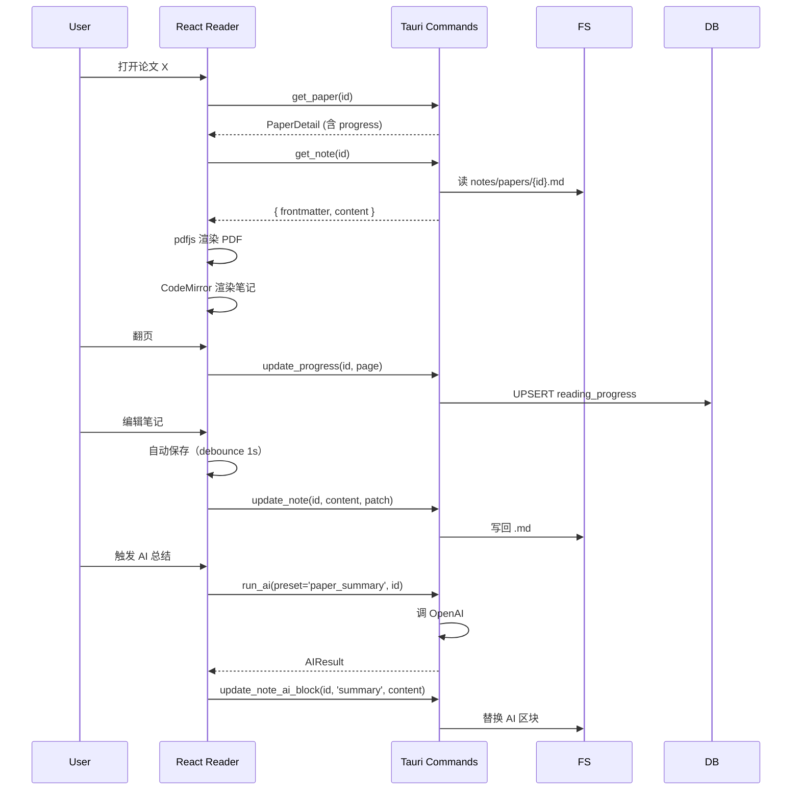
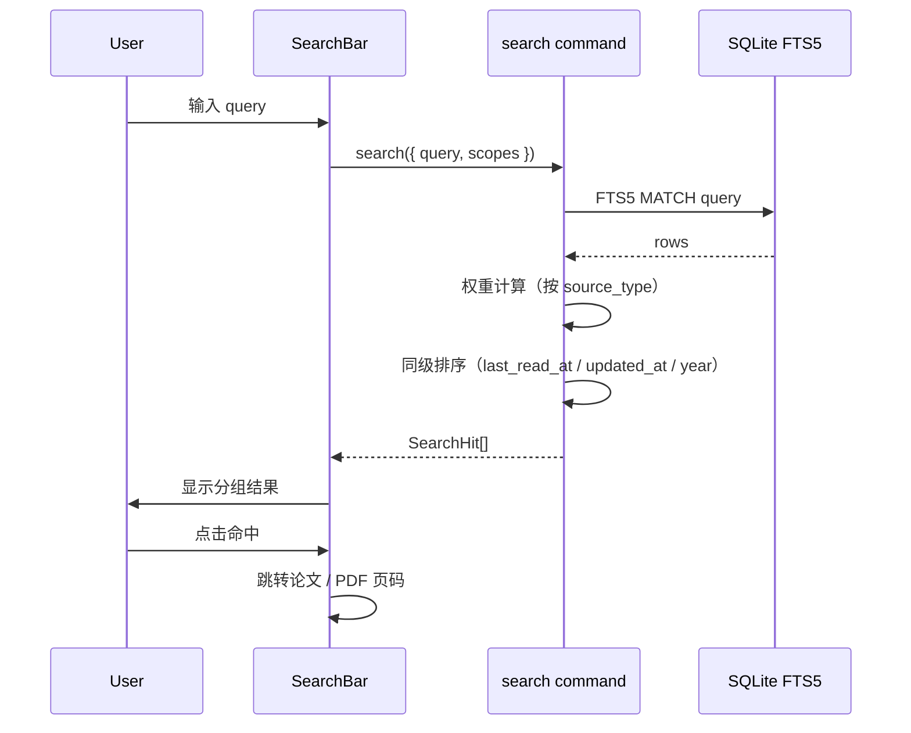
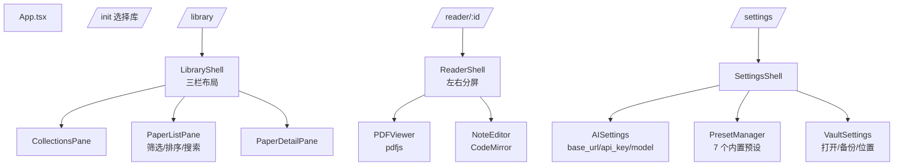

# DESIGN — PaperVault 系统架构设计

> 任务代号：`paper-vault`
> 版本：v1.0 — 2026-06-14
> 上游文档：[CONSENSUS_paper-vault.md](./CONSENSUS_paper-vault.md)

## 一、整体架构图



## 二、分层设计

### 2.1 前端分层

```
routes/             顶层路由：/library /reader/:id /settings
  ↓
components/         业务组件：LibraryPane / PaperList / PaperDetail / ReaderWorkspace
  ↓
components/ui/      shadcn 原子组件：Button / Dialog / Table / Input ...
  ↓
hooks/              usePapers / useSearch / useAI / useDebounce
  ↓
stores/             usePaperStore / useUIStore / useSettingsStore
  ↓
lib/api.ts          invoke() 封装 + 类型化 IPC
  ↓
Tauri IPC
```

### 2.2 后端分层

```
main.rs / lib.rs    Tauri Builder，注册 commands
  ↓
commands/           IPC 入口，参数校验，返回 Result<T, AppError>
  ↓
services/           业务逻辑
  ↓
db/                 SQL 执行、迁移、查询构造
vault/              PaperVault 目录与文件管理
pdf/                pdf-extract 封装
markdown/           serde_yaml 解析 frontmatter
ai/                 reqwest + prompt 模板
export/             BibTeX / Markdown citation 模板
  ↓
File System / SQLite / HTTP
```

## 三、模块依赖关系



## 四、接口契约定义

### 4.1 IPC 命令清单（前端 invoke 名 = Rust 函数名）

| 命令 | 入参 | 返回 | 说明 |
|---|---|---|---|
| `init_vault` | `{ path: string }` | `{ ok: true }` | 选择/创建库目录并跑迁移 |
| `get_vault_info` | - | `{ path, paperCount, indexedCount }` | 库状态 |
| `import_pdf` | `{ sourcePath: string }` | `Paper` | 单 PDF 导入 |
| `import_pdfs_batch` | `{ sourcePaths: string[] }` | `ImportResult[]` | 批量导入 |
| `list_papers` | `{ filter?, sort? }` | `Paper[]` | 论文列表（带 reading_progress） |
| `get_paper` | `{ id: string }` | `PaperDetail` | 论文详情 |
| `update_paper` | `{ id, patch: Partial<Paper> }` | `Paper` | 改元数据 |
| `update_progress` | `{ id, currentPage, totalPages? }` | `ReadingProgress` | 存阅读进度 |
| `check_duplicates` | `{ id?, doi?, title? }` | `DuplicateCandidate[]` | 疑似重复 |
| `delete_paper` | `{ id, mode: 'entry'\|'entry+pdf'\|'entry+pdf+note' }` | `{ ok: true }` | 删除 |
| `extract_metadata` | `{ id }` | `MetadataCandidate` | 从 PDF 提取元数据 |
| `create_note` | `{ id, template?: string }` | `{ path: string }` | 创建笔记 |
| `import_note` | `{ id, sourcePath: string }` | `{ path: string }` | 导入 md |
| `get_note` | `{ id }` | `NoteContent` | 读取 md 全文 |
| `update_note` | `{ id, content, frontmatterPatch? }` | `{ ok: true }` | 保存 |
| `update_note_ai_block` | `{ id, block: 'summary'\|'key_points', content }` | `{ ok: true }` | 写 AI 区块 |
| `search` | `{ query, scopes?: string[] }` | `SearchHit[]` | 全文搜索 |
| `reindex_paper` | `{ id }` | `{ ok: true }` | 单篇重新建索引 |
| `reindex_all` | - | `{ ok: true }` | 全量重建 |
| `get_ai_presets` | - | `AISkillPreset[]` | 读全部预设 |
| `update_ai_preset` | `{ id, patch }` | `AISkillPreset` | 改用户版本 |
| `reset_ai_preset` | `{ id }` | `AISkillPreset` | 恢复默认 |
| `run_ai` | `{ presetId, paperId?, input }` | `AIResult` | 跑 AI |
| `get_ai_config` | - | `AIProviderConfig` | 读 AI 配置 |
| `update_ai_config` | `{ patch }` | `AIProviderConfig` | 写 AI 配置 |
| `export_bibtex` | `{ ids: string[] }` | `string` | 生成 BibTeX |
| `export_markdown_citation` | `{ ids: string[] }` | `string` | 生成 md 引用 |
| `open_vault_folder` | - | `{ ok: true }` | 系统资源管理器打开库 |
| `backup_database` | - | `{ path: string }` | 导出 db 备份 |
| `list_collections` | - | `Collection[]` | |
| `create_collection` | `{ name, parentId? }` | `Collection` | |
| `add_paper_to_collection` | `{ paperId, collectionId }` | `{ ok: true }` | |
| `remove_paper_from_collection` | `{ paperId, collectionId }` | `{ ok: true }` | |
| `list_keywords` | - | `string[]` | |
| `list_tags` | - | `string[]` | |
| `load_seed_data` | - | `{ paperIds: string[] }` | 加载示例 |
| `get_fts_status` | - | `IndexStatusSummary` | 索引状态聚合 |

### 4.2 核心数据类型

```typescript
// 与 Rust 共享（snake_case 由 serde 自动转换）
interface Paper {
  id: string;
  title: string;
  authors: string[];
  year: number | null;
  venue: string;
  doi: string;
  abstract: string;
  keywords: string[];
  tags: string[];
  status: '未读' | '阅读中' | '已读' | '重点重读';
  rating: number | null;
  pdf_path: string;
  note_path: string;
  created_at: number;  // unix ms
  updated_at: number;
}

interface PaperDetail extends Paper {
  reading_progress: ReadingProgress | null;
  index_status: '未索引' | '索引中' | '已索引' | '索引失败';
  collections: string[];   // collection ids
}

interface ReadingProgress {
  paper_id: string;
  current_page: number;
  total_pages: number;
  progress_percent: number;
  last_read_at: number;
}

interface MetadataCandidate {
  title: string;
  authors: string[];
  year: number | null;
  venue: string;
  doi: string;
  abstract: string;
  keywords: string[];
  source: 'doi' | 'pdf-text' | 'filename' | 'ai' | 'manual';
  confidence: 'high' | 'medium' | 'low';
}

interface AISkillPreset {
  id: string;
  name: string;
  bound_action: string;
  skill: 'pdf' | 'research-lookup' | 'literature-review' | 'none';
  system_prompt: string;
  user_template: string;
  output_format: 'json' | 'markdown';
  auto_write: boolean;
  is_builtin: boolean;
  updated_at: number;
}

interface AIProviderConfig {
  base_url: string;
  api_key: string;
  model: string;
}

interface SearchHit {
  paper_id: string;
  source_type: 'title'|'authors'|'abstract'|'keywords'|'notes'|'pdf';
  snippet: string;     // 高亮片段
  page?: number;       // PDF 命中时
  score: number;
}
```

## 五、数据流向图

### 5.1 PDF 导入流程



### 5.2 阅读工作台数据流



### 5.3 全文搜索流程



## 六、异常处理策略

| 异常场景 | 处理 |
|---|---|
| 库目录无写权限 | 启动时检查 → 弹窗要求重选 |
| PDF 文件已损坏 | 导入成功 + index_status=索引失败 + 弹窗提示 |
| DOI 解析失败 | 退到 PDF 文本提取，再退到文件名 |
| AI API 401/超时 | 错误回传到前端 + Toast + 保留输入不丢 |
| Markdown 写入冲突 | 应用单进程，写前重新读 → 合并 frontmatter |
| 库目录被外部修改 | 启动时不做强制扫描，仅在用户操作时按需同步 |
| SQLite 锁 | 启用 WAL 模式 + busy_timeout=5s |
| 索引失败 | 状态写入 DB，不影响阅读，UI 显示"重新索引"按钮 |
| 重复检测冲突 | 不阻塞，疑似结果以列表展示供用户决策 |
| 删除误操作 | 删除前确认对话框，删除时不直接清文件 |

## 七、前端路由与页面结构



## 八、状态管理（Zustand Store 划分）

```typescript
// stores/paper.ts
usePaperStore {
  papers: Paper[]
  currentPaper: PaperDetail | null
  listFilter: { keyword?, status?, tag?, collectionId? }
  listSort: 'recent' | 'year' | 'title' | 'progress'
  // actions
  loadPapers, selectPaper, updatePaperLocally
}

// stores/note.ts
useNoteStore {
  currentNote: { frontmatter, content } | null
  isDirty: boolean
  // actions
  loadNote, saveNote, updateAIBlock
}

// stores/search.ts
useSearchStore {
  query: string
  hits: SearchHit[]
  isSearching: boolean
  // actions
  search
}

// stores/settings.ts
useSettingsStore {
  aiConfig: AIProviderConfig
  presets: AISkillPreset[]
  // actions
  loadConfig, saveConfig, updatePreset, resetPreset
}

// stores/ui.ts
useUIStore {
  sidebarOpen: boolean
  theme: 'light' | 'dark'
  toast: Toast | null
}
```

## 九、关键技术细节

### 9.1 FTS5 索引策略
- 索引时机：导入后异步建索引（在后台 tokio 任务）
- 索引源类型：`title` `authors` `abstract` `keywords` `notes` `pdf`
- PDF 索引粒度：每页一条记录，带 `page` 字段
- tokenizer：`unicode61 remove_diacritics 2`（支持中文）
- 删除论文时 FTS5 行自动级联（外键 ON DELETE CASCADE）

### 9.2 重复检测算法
```
1. DOI 命中（大小写不敏感、去 `https://doi.org/` 前缀）→ 高置信
2. 标题归一化：
   - 转小写、去标点、合并空白
   - 移除常见停用词（a, the, of, ...）
   - 截断到前 100 字符
3. 归一化后相同 + 年份相同（±1）→ 中置信
4. 第一作者姓氏 + 年份相同 + 标题编辑距离 < 0.1 → 低置信
```

### 9.3 Markdown frontmatter 同步
- 写入：始终用 `serde_yaml::to_string` 重写
- 读取：`serde_yaml::from_str` 反序列化为 `serde_json::Value`，与 DB 比对
- 冲突：DB 优先（依据规范）
- 导入外部 md：解析 frontmatter，只补全 DB 空字段，冲突弹窗

### 9.4 AI 区块安全更新
- 解析时定位 `<!-- AI_GENERATED_START:xxx -->` 与 `<!-- AI_GENERATED_END:xxx -->`
- 替换中间内容，保留区块外所有行
- 失败回退：写入失败时返回错误，不动文件

### 9.5 性能
- 列表分页：每页 50 条，滚动加载
- 搜索：FTS5 + LIMIT 100
- PDF 渲染：按需懒加载页码
- Markdown 保存：debounce 1s
- 索引构建：tokio 后台，限流 1 并发

## 十、安全模型

| 项 | 处理 |
|---|---|
| API key | 存 SQLite `ai_provider_config`，不写入磁盘其他位置、不入 git |
| .env.example | 列出变量名，值留空 |
| 用户文件 | 永远复制到 `PaperVault/`，不修改源 PDF |
| 删除 | 默认仅删 DB 记录 |
| 文件路径 | 禁止 `..` 穿越，所有路径校验 |
| PDF 导入 | 限制 200MB + 扩展名白名单 |
| 启动 | 检测库目录存在 + 可写，否则要求重选 |

## 十一、测试策略

### 11.1 Rust（cargo test）
- `vault` 模块：创建/复制/命名 slug
- `db/migrations`：迁移幂等
- `duplicates`：DOI / 标题归一化
- `markdown`：frontmatter 解析 / AI 区块定位
- `bibtex` / `citation`：模板生成
- `ai/presets`：模板替换

### 11.2 前端（Vitest）
- `lib/bibtex.ts`：BibTeX 模板
- `lib/format.ts`：日期、作者格式化
- `lib/slug.ts`：标题 slug
- `hooks/useDebounce`
- `stores/*`：reducer 逻辑

### 11.3 手工 E2E（开发期）
- 启动 dev 模式走通 12 项功能验收

## 十二、阶段交付检查清单

进入 Automate 之前需要确认：
- [x] 架构图清晰
- [x] IPC 命令清单完整
- [x] 数据模型与 CONSENSUS 一致
- [x] 异常处理策略覆盖
- [x] 测试策略明确
- [x] 风险有缓解方案

## 十三、下一阶段

进入 **Atomize 阶段**：
- 将 v1 拆分为可独立交付的原子任务
- 标注依赖关系
- 每个任务有输入/输出契约
- 后续进入 Approve 阶段等待最终人工审批
