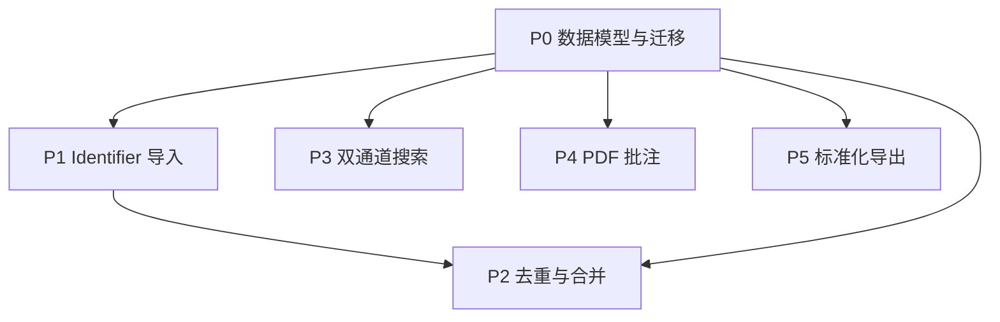

# trea 对齐 Zotero 优化 — Implementation Plan

> 目标：在不改变 `trea` 轻量化定位的前提下，落实 [`SPEC_zotero_alignment.md`](./SPEC_zotero_alignment.md) 的 6 个 phase：数据模型、identifier 导入、去重合并、双通道搜索、PDF 批注、标准化导出。
>
> 本 plan 保留 SPEC 的产品目标与 phase 边界，但修正为**可在当前代码上直接实施**的工程路径。

---

## 0. 实施约束与关键修正

### 0.1 与当前代码保持一致的实现前提

- **保持现有主键类型为 `TEXT`**
  - 当前 `papers.id`、`collections.id`、`reading_progress.paper_id`、命令参数、前端类型都使用字符串 ID。
  - 本轮不把主键整体切换为 `INTEGER`，避免连锁重写前后端与现有库数据。
- **保持当前 DB 访问模型**
  - 继续使用 `crate::db::open(vault)` 获取连接。
  - 本轮不引入全局 `state.db.lock()` 持久连接模型。
- **保持 Markdown 笔记文件语义**
  - `papers.note_path` 保留。
  - `.md` 文件继续作为用户长期资产，不改成数据库主存储。
- **保持现有库目录与 vault 逻辑**
  - 继续基于 `vault/notes/pdfs/backups/exports` 工作。

### 0.2 对 SPEC 的工程修正

- SPEC 中“dev 阶段一次性换新表 + drop 旧 JSON + 不回退”保留为**产品决策**，但实现上改为：
  1. 先自动备份 `vault.db`
  2. 迁移脚本先尝试把旧 JSON 字段搬到新结构化表
  3. 迁移成功后，应用层完全停止使用旧 JSON 字段
  4. 旧字段是否物理删除，放到 P0 末尾统一做，不在早期 task 中直接清库
- SPEC 中 “FTS 只索引 metadata，不含 PDF 全文” 保持不变。
  - 现有 `fulltext_index` 会收敛成 metadata-only 索引方案。
  - 不再同时维护第二套与 PDF 全文耦合的搜索口径。
- SPEC 中 phase 边界保留，但工程上不把 P3/P4/P5 当作完全独立。
  - 它们都依赖 P0 的新 schema 和共享 types。

### 0.3 本 plan 采用的交付粒度

- 不要求“每个 2-5 分钟 task 一次 commit”。
- 改为**每个可运行子里程碑一次 commit**：
  - `P0-schema`
  - `P1-resolvers`
  - `P2-merge`
  - `P3-search`
  - `P4-annotations`
  - `P5-export`
- 测试策略保持 TDD 倾向，但允许按模块写完整测试后再实现。

---

## 1. 总体架构

### 1.1 后端（Rust）

- 继续使用 `rusqlite + vault path + open(vault)`。
- 新增或扩展 service：
  - `services/resolver.rs`
  - `services/duplicates.rs`
  - `services/search.rs`
  - `services/annotation.rs`
  - `services/export.rs`
- command 层仅负责参数转换和错误返回，不承载核心合并/搜索逻辑。

### 1.2 前端（React）

- 保持现有页面结构：
  - 论文库三栏
  - 阅读页
  - 设置页
- 新增或扩展组件：
  - `ImportDialog`
  - `MergeDialog`
  - `AnnotationSidebar`
  - `ExportPanel` 扩展
  - `SearchBar/SearchPanel` 扩展

### 1.3 数据库策略

- 新增 `0002_zotero_alignment.sql`
- 在迁移中完成：
  - 新表创建
  - 旧数据搬运
  - 兼容性检查
- `0001_init.sql` 不回写，不直接改历史基线。

---

## 2. Phase 顺序

说明：
- P0 完成前，不进入其他 phase。
- P2 依赖 P0 新 schema 和 P1 产生的标准化 metadata。
- P3/P4/P5 可以在 P0 后交叉推进，但共享 type/schema 变更要先统一。

---

## 3. P0 数据模型与迁移

### 3.1 目标

- 从 `papers.authors/keywords/tags` JSON 字段迁移到结构化表。
- 保留当前 `TEXT` 主键体系。
- 保留 `collections / paper_collections / reading_progress / ai_* / note_path / pdf_path`。
- 应用层在 P0 结束后只读写新结构化表。

### 3.2 新增表

- `creators`
- `paper_creators`
- `identifiers`
- `keywords`
- `paper_keywords`
- `attachments`
- `paper_relations`
- `annotations`
- `merge_log`
- `papers_fts`

### 3.3 主表与现有字段

- `papers` 保留并扩展，不换主键类型：
  - `id TEXT PRIMARY KEY`
  - `title`
  - `year`
  - `venue`
  - `doi`
  - `abstract_text`
  - `status`
  - `rating`
  - `pdf_path`
  - `note_path`
  - `created_at`
  - `updated_at`
- `status` 在 Rust/TS 层最终统一为：
  - 后端持久化：`unread | reading | read`
  - 前端展示：通过映射输出中文
- 迁移时需把旧值：
  - `未读 -> unread`
  - `阅读中 -> reading`
  - `已读 -> read`
  - `重点重读 -> read` 并在后续作为非目标删去

### 3.4 迁移策略

1. 检测是否存在旧 JSON 字段 schema。
2. 备份现有 `vault.db` 到 `backups/` 或同目录带时间戳文件。
3. 创建新结构化表。
4. 遍历旧 `papers`：
   - 将 `authors` JSON 拆入 `creators + paper_creators`
   - 将 `keywords` JSON 拆入 `keywords + paper_keywords`
   - `tags` 本轮不再延续到新 schema
5. `attachments` 为每篇已有论文补一条主 PDF 记录；若有 `note_path`，补一条 note attachment 记录。
6. 重建 `papers_fts`。
7. 所有数据搬运成功后，应用层切到新 schema。
8. 旧 JSON 字段的物理删除放到 P0 最后一步；若 SQLite 重建成本过高，可接受“列保留但逻辑废弃”作为 P0 完成态。

### 3.5 P0 需要修改的模块

- `src-tauri/src/db/mod.rs`
  - 支持顺序执行 `0001_init.sql` + `0002_zotero_alignment.sql`
  - 新增 schema version 检测
- `src-tauri/src/db/migrate_v2.rs`
  - 负责备份、迁移、失败回滚
- `src-tauri/src/types.rs`
  - 新增 `Creator / Identifier / Keyword / Attachment / Annotation / MergeResult`
  - 调整 `Paper.status`
- `src/types/index.ts`
  - 同步新增类型与状态枚举
- `services/paper.rs`
  - `get/list/update/insert/delete` 改为读写结构化表

### 3.6 P0 验收

- 新 schema 建表成功
- 旧论文主记录保留
- 作者/关键词拆分成功
- `status` 正规化成功
- 旧库备份存在
- 现有 UI 仍能打开、列出、查看论文详情

---

## 4. P1 Identifier 优先导入

### 4.1 目标

- 在保留 PDF 导入的前提下，引入 DOI / arXiv / PMID / ISBN 四类解析与拉取。
- 新增 identifier-first 导入入口，不强行替换原有 `import_pdf`。

### 4.2 实现策略

- 新增 `IdentifierParser`
  - 输入：纯文本 / URL / DOI 字符串 / arXiv 标识 / PMID / ISBN
  - 输出：`Option<{ scheme, value }>`
- 新增 `Resolver` trait 和 4 个 resolver：
  - `CrossrefResolver`
  - `ArxivResolver`
  - `PubMedResolver`
  - `OpenLibraryResolver`
- `import_by_identifier`
  - 解析 -> 拉取 metadata -> 调用 P2 duplicate check -> 入库
- `import_pdf`
  - 先从 PDF 文本尝试抽 DOI / arXiv 等
  - 命中则复用 resolver
  - 未命中则回退到现有 `pdf::extract_basic`

### 4.3 元数据结构

- `MetadataCandidate` 扩展为：
  - `title`
  - `authors`
  - `year`
  - `venue`
  - `doi`
  - `abstract_text`
  - `keywords`
  - `identifiers: IdentifierDraft[]`
  - `source`
  - `confidence`

### 4.4 P1 需要修改的模块

- `src-tauri/src/commands/papers.rs`
- `src-tauri/src/services/resolver.rs`
- `src-tauri/src/pdf.rs`
- `src/lib/api.ts`
- 新增导入对话框或扩展现有导入入口

### 4.5 P1 验收

- 4 种 identifier 都有解析单测
- 至少 DOI / arXiv 路径完成网络解析
- `import_pdf` 可优先复用 identifier
- 网络错误、404、限流都有明确报错

---

## 5. P2 去重与合并

### 5.1 目标

- 实现导入时精确/模糊去重。
- 支持安全合并与 5 分钟内撤销。

### 5.2 检测策略

- 精确重复：
  - `(scheme, value)` 命中 `identifiers`
- 模糊重复：
  - DOI 规范化后相同
  - 标题归一化相似度 >= 0.85
  - 可选参考年份接近、作者重叠
- 后台扫描：
  - 本轮先实现 service，不强制首版做启动后台任务

### 5.3 合并策略

- `title/year/venue/abstract_text/doi`
  - 以新源值补齐空值；非空冲突默认保留目标值，UI 给出提示
- `keywords`
  - `auto` 覆盖旧 `auto`
  - `manual` 并集保留
- `status/rating/note_path/reading_progress`
  - 保留目标论文
- `attachments/annotations/identifiers/paper_relations`
  - 并集去重
- `paper_creators`
  - 以规范化姓名去重，保留目标论文顺序

### 5.4 撤销

- 合并前将 `src/dst` 快照写入 `merge_log`
- 返回 `merge_id`
- `undo_merge(merge_id)` 恢复结构化表和主表状态
- 5 分钟清理可作为后台轻量任务，不阻塞首版功能

### 5.5 P2 需要修改的模块

- `src-tauri/src/services/duplicates.rs`
- `src-tauri/src/commands/papers.rs`
- 新增 `MergeDialog`

### 5.6 P2 验收

- 同 DOI 二次导入会触发提示
- 合并后附件、关键词、标识符仍完整
- 5 分钟内撤销可恢复

---

## 6. P3 双通道搜索

### 6.1 目标

- 从当前单一搜索升级为：
  - Structured 搜索
  - Free text 搜索
  - Both 模式

### 6.2 索引策略

- 遵循 SPEC：**只索引 metadata，不含 PDF 全文**
- `papers_fts` 索引来源：
  - `papers.title`
  - `papers.abstract_text`
  - `papers.venue`
  - creators 拼接字符串
  - keywords 拼接字符串
- 不再把 `.md` 内容和 PDF 正文纳入 FTS

### 6.3 结构化搜索

- 支持：
  - `title`
  - `author`
  - `year`
  - `venue`
  - `doi`
  - `status`
  - `keyword`
- `list_papers` 保持兼容，新增单独 `search_structured` 命令

### 6.4 前端模式

- 顶部模式切换：
  - `structured`
  - `fulltext`
  - `both`
- `both`：先 FTS 命中，再用 structured 过滤

### 6.5 P3 需要修改的模块

- `src-tauri/src/services/search.rs`
- `src-tauri/src/commands/search.rs`
- `src/stores/search.ts`
- `src/components/search/SearchPanel.tsx`
- `src/components/library/TopBar.tsx` 或现有搜索入口

### 6.6 P3 验收

- 7 个结构化字段可用
- FTS 排序稳定
- Both 模式行为正确
- 大库下查询不超时

---

## 7. P4 PDF 批注

### 7.1 目标

- 实现最小 Zotero 风格批注：
  - 选区
  - 评论
  - 5 色
  - 侧边栏

### 7.2 数据模型

- `annotations`
  - `id TEXT PRIMARY KEY` 或继续使用 UUID 文本
  - `paper_id TEXT`
  - `page INTEGER`
  - `bbox_x/y/w/h REAL`
  - `selected_text TEXT`
  - `comment TEXT`
  - `color TEXT`
  - `created_at/updated_at INTEGER`

### 7.3 UI 行为

- 阅读器选中文本 -> 出现 mini toolbar
- 选色直接保存
- 评论按钮打开输入
- 侧边栏支持：
  - 按页筛选
  - 按颜色筛选
  - 点击跳转
  - 编辑评论
  - 删除

### 7.4 Markdown 同步

- 首版不做自动双向同步
- 只提供“导出批注到笔记固定区块”的单向动作
- 固定区块格式需要明确：
  - 开始标记
  - 每条批注包含页码、颜色、引用文本、评论
  - 再次导出时按 `annotation id` 去重，避免覆盖用户自由内容

### 7.5 P4 需要修改的模块

- `src-tauri/src/services/annotation.rs`
- `src-tauri/src/commands/notes.rs`
- `src/components/reader/PDFViewer.tsx`
- 新增 `src/components/reader/AnnotationSidebar.tsx`

### 7.6 P4 验收

- 5 色批注可保存
- 批注列表可回显
- 跳转定位可用
- 导出到 Markdown 固定区块不覆盖用户手写内容

---

## 8. P5 标准化导出

### 8.1 目标

- 导出：
  - BibTeX
  - RIS
  - CSL-JSON

### 8.2 中间模型

- 统一先做 `paper_to_csl_json()`
- 再由 CSL-JSON 转：
  - BibTeX
  - RIS

### 8.3 当前实现边界

- 不引入 `citeproc`
- 不做 `.csl` 样式渲染
- 不做 Word/HTML 引用渲染

### 8.4 文件写出方式

- 不使用不存在的 `write_text_file` 自定义 command
- 采用以下二选一，优先前者：
  1. 前端用 `@tauri-apps/plugin-fs` 写文件
  2. 若权限或编码受限，再补一个最小 Rust command 专门写 UTF-8 文本

### 8.5 P5 需要修改的模块

- `src-tauri/src/services/export.rs`
- `src-tauri/src/commands/export.rs`
- `src/lib/api.ts`
- `src/components/settings/ExportPanel.tsx`

### 8.6 P5 验收

- BibTeX 可被 Zotero 导入
- RIS 可被 EndNote/Mendeley 导入
- CSL-JSON 可被 Pandoc 消费
- 中文与特殊字符转义正确

---

## 9. 测试策略

### 9.1 Rust 单元测试

- migration/version detection
- status 映射与 CHECK 约束
- identifier parser
- resolver response parse
- DOI normalize
- title similarity
- merge field strategy
- structured search SQL 组合
- FTS 结果排序
- annotation bbox normalize
- CSL/BibTeX/RIS 转换

### 9.2 Rust 集成测试

- 旧库 -> P0 迁移 -> 新 schema 可读
- PDF 导入 -> metadata 入库
- identifier 导入 -> duplicate check
- merge -> undo
- search structured/fulltext/both
- annotation CRUD
- export 三格式

### 9.3 前端测试

- ImportDialog
- MergeDialog
- Search mode switch
- AnnotationSidebar
- ExportPanel

### 9.4 手动验收流

1. 打开旧 vault，自动备份并迁移
2. 旧论文仍可展示
3. 用 DOI 导入新论文
4. 同 DOI 二次导入并合并/撤销
5. 搜索三模式验证
6. 打开 PDF 新建批注
7. 导出三种格式验证

---

## 10. 实施顺序

### 10.1 里程碑 A：P0

- 完成 schema、新类型、迁移、paper service 适配
- 目标：应用在新 schema 下可正常启动和读写

### 10.2 里程碑 B：P1 + P2

- 完成 identifier 解析、resolver、duplicate check、merge/undo
- 目标：导入链路标准化

### 10.3 里程碑 C：P3

- 完成 structured/fulltext/both
- 目标：搜索能力对齐 SPEC

### 10.4 里程碑 D：P4

- 完成批注 schema、CRUD、侧边栏、Markdown 导出

### 10.5 里程碑 E：P5

- 完成 CSL-JSON / BibTeX / RIS 导出

---

## 11. 明确不做

- Zotero 同步协议
- Word / LibreOffice 集成
- OCR
- PDF 全文搜索
- 智能集合
- 自定义 CSL 样式
- 多人/多端协作

---

## 12. 完成定义

本 plan 完成的标志是：

- P0-P5 对应命令、service、前端入口都可运行
- 迁移后旧 vault 可读
- 搜索、导入、合并、批注、导出都有自动化测试
- README / FINAL 文档同步更新为 v2 行为

---

**PLAN 状态**：v2.0 — 已按 SPEC 目标和当前代码现实约束重写，可进入实施阶段。
