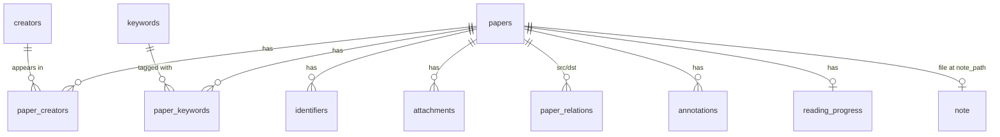

# SPEC — `trea` 对齐 Zotero 核心能力的轻量化优化方案

> 阶段：Brainstorming → Design
> 上一版：[`SPEC_v1.5_topic_review.obsolete.md`](./SPEC_v1.5_topic_review.obsolete.md)（已废弃）
> 目标：在 v1 基础上对齐 Zotero 6 个核心能力（数据模型、identifier 导入、去重合并、双通道搜索、PDF 批注、标准化导出），保持 trea 轻量化定位（单人本地、Markdown 笔记、AI 集成）。

---

## 0. 决策摘要（TL;DR）

| # | 决策点 | 选择 |
|---|---|---|
| Q1 | 迁移策略 | 直接换新表 + drop 旧 JSON（dev 阶段无双轨/弹窗/回退） |
| Q2.1 | tags 去留 | 删 `tags`/`paper_tags`，规范化 `papers.status` 枚举（`unread`/`reading`/`read`） |
| Q2.2 | keywords 编辑语义 | keywords 加 `source` 字段（`auto`/`manual`），重导入只刷新 `auto`，保留 `manual` |
| Q3 | identifier 范围 | DOI + arXiv + PMID + ISBN 四种标准标识符 |
| Q4 | 去重检测 | 三时机全覆盖（导入精确 + 导入模糊 + 启动/重索引后台扫） |
| Q5 | 合并冲突 | 字段级默认策略 + 5 分钟内可撤销（M-1） |
| Q6 | PDF 全文搜索 | 不含 PDF 全文（FTS 只索引 metadata） |
| Q7 | PDF 批注模型 | 选区 + 评论 + 5 色枚举（黄/红/绿/蓝/紫） |
| Q8 | 导出深度 | BibTeX + RIS + CSL-JSON 三种直出，不引入 citeproc |
| Q9 | 笔记存储 | 保持 `.md` 文件，papers.note_path 保留 |

---

## 1. 背景与目标

### 1.1 v1 现状

- 数据模型以 JSON 字段为主：`papers.keywords`/`tags`/`authors` 均为 `TEXT DEFAULT '[]'`，查询用 `json_each`。
- 导入路径只有 PDF（`import_pdf`），identifier 优先级弱。
- 无去重合并机制。
- FTS5 已存在但只覆盖 `title/abstract/keywords`。
- 导出为简化自定义 JSON（[ExportPanel.tsx](file:///f:/learn/study/ai/trea/src/components/settings/ExportPanel.tsx)）。
- 无 PDF 批注。
- `status` 字段已存在但未约束枚举值。

### 1.2 目标

对齐 Zotero 6 个核心能力，同时保持 trea 轻量化：

1. **数据模型重构**：从 JSON 字段 → 关系型 + 规范化字典表
2. **Identifier 优先导入**：从 PDF-only → identifier-first（DOI/arXiv/PMID/ISBN）
3. **去重与合并**：单点导入不感知重复 → 三时机全检测 + 字段级合并 + 可撤销
4. **双通道搜索**：单 FTS → 字段搜索 + 全文搜索双通道
5. **PDF 批注**：无 → 选区 + 评论 + 颜色（Zotero 风格子集）
6. **标准化导出**：自定义 JSON → BibTeX / RIS / CSL-JSON

### 1.3 非目标

- 不做 Zotero 同步 / 协作
- 不做 Word/LibreOffice 插件
- 不做完整 citeproc 引擎
- 不做 RSS 抓取
- 不做 OCR（PDF 文本提取在 P6 之后单独 phase）
- 不做多人 / 多设备

### 1.4 设计原则

- **轻量化优先**：每个 phase 必须能独立交付、可回退
- **不破坏 markdown 笔记**：保持 `.md` 文件，与 git 友好
- **可测试**：关键算法（去重、合并、FTS 权重）必须有单元测试
- **用户数据安全**：合并可逆 5 分钟，PDF 文件永不删

---

## 2. 阶段规划

| 阶段 | 内容 | 关键产物 | 依赖 |
|---|---|---|---|
| **P0** | 数据模型重构 | 7 张新表 + 旧 JSON 字段 drop + status 枚举 | — |
| **P1** | 标识符优先导入 | 4 个 identifier resolver + 拉取管线 | P0 |
| **P2** | 去重与合并 | 检测算法 + 合并策略 + 撤销 | P0, P1 |
| **P3** | 双通道搜索 | 字段搜索 + FTS 全文 + 合并展示 | P0 |
| **P4** | PDF 批注 | 选区 + 评论 + 5 色 | P0 |
| **P5** | 标准化导出 | BibTeX + RIS + CSL-JSON | P0 |

每个 phase 独立可交付、可回退；上一 phase 验收通过才进入下一 phase。

---

## 3. 详细设计

### 3.1 P0 数据模型

#### 3.1.1 概念 ER 图



#### 3.1.2 表结构

```sql
-- papers (精简主表)
CREATE TABLE papers (
  id INTEGER PRIMARY KEY,
  title TEXT NOT NULL,
  year INTEGER,
  venue TEXT,
  doi TEXT,                  -- 主 DOI（冗余便于查询）
  abstract TEXT,
  status TEXT NOT NULL DEFAULT 'unread'
    CHECK (status IN ('unread','reading','read')),
  rating INTEGER,
  note_path TEXT,            -- 笔记 .md 路径（N-1 保持）
  created_at TEXT NOT NULL,
  updated_at TEXT NOT NULL
);

-- creators (作者归一化)
CREATE TABLE creators (
  id INTEGER PRIMARY KEY,
  family TEXT NOT NULL,
  given TEXT,
  orcid TEXT
);
CREATE UNIQUE INDEX idx_creators_unique
  ON creators(LOWER(family), LOWER(COALESCE(given,'')), COALESCE(orcid,''));

-- paper_creators (多对多 + 顺序)
CREATE TABLE paper_creators (
  paper_id INTEGER NOT NULL REFERENCES papers(id) ON DELETE CASCADE,
  creator_id INTEGER NOT NULL REFERENCES creators(id) ON DELETE CASCADE,
  ord INTEGER NOT NULL,        -- 作者顺序
  is_corresponding BOOLEAN DEFAULT 0,
  PRIMARY KEY (paper_id, creator_id)
);

-- identifiers (多类型标识符，全局唯一)
CREATE TABLE identifiers (
  id INTEGER PRIMARY KEY,
  paper_id INTEGER NOT NULL REFERENCES papers(id) ON DELETE CASCADE,
  scheme TEXT NOT NULL CHECK (scheme IN ('doi','arxiv','pmid','isbn')),
  value TEXT NOT NULL,
  UNIQUE (scheme, value)        -- 全局唯一
);
CREATE INDEX idx_identifiers_paper ON identifiers(paper_id);

-- keywords (B1: 带 source 追踪)
CREATE TABLE keywords (
  id INTEGER PRIMARY KEY,
  name TEXT NOT NULL UNIQUE,
  source TEXT NOT NULL CHECK (source IN ('auto','manual')) DEFAULT 'manual',
  created_at TEXT NOT NULL
);

-- paper_keywords
CREATE TABLE paper_keywords (
  paper_id INTEGER NOT NULL REFERENCES papers(id) ON DELETE CASCADE,
  keyword_id INTEGER NOT NULL REFERENCES keywords(id) ON DELETE CASCADE,
  PRIMARY KEY (paper_id, keyword_id)
);

-- attachments
CREATE TABLE attachments (
  id INTEGER PRIMARY KEY,
  paper_id INTEGER NOT NULL REFERENCES papers(id) ON DELETE CASCADE,
  kind TEXT NOT NULL CHECK (kind IN ('pdf','note')),
  path TEXT NOT NULL,
  sha256 TEXT,
  added_at TEXT NOT NULL
);

-- paper_relations
CREATE TABLE paper_relations (
  id INTEGER PRIMARY KEY,
  src_paper_id INTEGER NOT NULL REFERENCES papers(id) ON DELETE CASCADE,
  dst_paper_id INTEGER NOT NULL REFERENCES papers(id) ON DELETE CASCADE,
  rel_type TEXT NOT NULL CHECK (rel_type IN ('cites','recommended','related'))
);

-- annotations (P4)
CREATE TABLE annotations (
  id INTEGER PRIMARY KEY,
  paper_id INTEGER NOT NULL REFERENCES papers(id) ON DELETE CASCADE,
  page INTEGER NOT NULL,
  bbox_x REAL, bbox_y REAL, bbox_w REAL, bbox_h REAL,
  selected_text TEXT,
  comment TEXT,
  color TEXT NOT NULL CHECK (color IN ('yellow','red','green','blue','purple')),
  created_at TEXT NOT NULL,
  updated_at TEXT NOT NULL
);
CREATE INDEX idx_annotations_paper ON annotations(paper_id);

-- reading_progress (保留 v1 字段)
CREATE TABLE reading_progress (...);  -- 同 v1

-- ai_* 表全部保留
-- collections / paper_collections 保留
```

#### 3.1.3 FTS5 虚表

```sql
CREATE VIRTUAL TABLE papers_fts USING fts5(
  title, abstract, venue,
  content='',                      -- 不存原文，从 papers JOIN
  tokenize='unicode61 remove_diacritics 2'
);
-- author/keyword 通过 trigger 同步进 papers_fts 的隐藏列
```

FTS 权重（用于 `bm25` 排序）：

| 字段 | 权重 |
|---|---|
| title | 10.0 |
| abstract | 5.0 |
| keywords | 4.0 |
| venue | 2.0 |
| author names | 1.0 |

#### 3.1.4 删除的旧字段/表

- ❌ `papers.keywords`（JSON 字段）
- ❌ `papers.tags`（JSON 字段）
- ❌ `papers.authors`（JSON 字段）
- ❌ `tags` 表
- ❌ `paper_tags` 表

dev 阶段一次性 drop，不保留 fallback。

#### 3.1.5 数据迁移策略

1. 用户启动 P0 build → 检测到旧 schema
2. **备份** `vault.db` → `vault.db.bak-{timestamp}`
3. 重建 schema（drop 旧表 + create 新表）
4. 不读旧 JSON 字段，全部清空
5. 已存在的 `.md` 笔记文件保留在磁盘（用户可手动 re-attach）

---

### 3.2 P1 标识符优先导入

#### 3.2.1 管线

```
User input (DOI/URL/PDF/text)
  → IdentifierParser.parse(input) → Option<(scheme, value)>
  → Resolver.fetch(scheme, value) → PaperMetadata
  → DuplicateChecker.check(metadata) (P2 复用)
      → 命中：弹 MergeDialog
      → 未命中：插入 papers + creators + identifiers + keywords
  → AttachmentManager.copy(pdf)
  → FTS indexer.update(paper_id)
```

#### 3.2.2 4 个 Resolver

| Scheme | 源 | API | 返回字段 |
|---|---|---|---|
| **DOI** | Crossref | `https://api.crossref.org/works/{doi}` | title, authors[], year, venue, abstract, subject[] |
| **arXiv** | arXiv | `https://export.arxiv.org/api/query?id_list={id}` | title, authors[], year, abstract, categories[] |
| **PMID** | NCBI E-utilities | `https://eutils.ncbi.nlm.nih.gov/entrez/eutils/esummary.fcgi?db=pubmed&id={pmid}` | title, authors[], year, venue, abstract |
| **ISBN** | OpenLibrary | `https://openlibrary.org/api/books?bibkeys=ISBN:{isbn}&format=json&jscmd=data` | title, authors[], year, publish_place |

#### 3.2.3 Identifier 解析

- DOI：`10\.\d{4,9}/[-._;()/:A-Z0-9]+`（带 `/`）
- arXiv：新格式 `\d{4}\.\d{4,5}`、旧格式 `[a-z\-]+(\.\d+)?/\d{7}`
- PMID：纯数字，1-8 位
- ISBN：10 或 13 位数字（带最后一位校验）

#### 3.2.4 错误处理

| 错误 | 用户反馈 |
|---|---|
| 404 / 解析失败 | "找不到该 identifier 的元数据，请检查或手填" |
| 网络超时 | "网络请求超时，请稍后重试" |
| 限流 (429) | "源服务限流，请稍后重试" |
| 部分字段缺失 | 允许导入，缺失字段为空 |

---

### 3.3 P2 去重与合并

#### 3.3.1 检测时机与算法

| 触发时机 | 检测内容 | 算法 | 用户体验 |
|---|---|---|---|
| **导入路径** | identifier 精确命中 | `identifiers` 表 UNIQUE 约束 | 弹复用对话框 |
| **导入路径** | DOI 匹配 / 标题模糊 | DOI 归一化比较 + Levenshtein (阈值 0.85) | 弹 MergeDialog |
| **启动 / 重索引** | 后台扫描 | 全表 `identifiers` 去重 + 标题相似 | 通知区显示建议列表 |

#### 3.3.2 DOI 规范化

```
"https://doi.org/10.xxx/yyy" → "10.xxx/yyy"
"doi:10.xxx/yyy"             → "10.xxx/yyy"
"10.XXX/YYY"                 → "10.xxx/yyy" (lowercase)
```

#### 3.3.3 标题相似度

- 算法：归一化（小写、去标点、collapse whitespace）后 Levenshtein ratio
- 阈值：0.85
- 排除：标题长度差 > 50% 的不比较

#### 3.3.4 合并字段策略 (M-1)

| 字段 | 策略 |
|---|---|
| `title` / `year` / `venue` / `abstract` | 取源更新值（last-write-wins） |
| `keywords` (auto) | 全部替换为新源值 |
| `keywords` (manual) | 全部保留并集 |
| `status` / `rating` | 保留用户值（dst paper 的） |
| `note_path` | 保留 dst paper 的 |
| `attachments` | 按 sha256 合并去重（无 sha256 按 path） |
| `annotations` | 全部保留并集 |
| `paper_creators` | 按 (family+given) 合并去重，dst 的 ord 优先 |
| `paper_relations` | 全部保留并集 |
| `identifiers` | 全部保留并集 |
| `reading_progress` | 保留 dst paper 的 |

#### 3.3.5 撤销机制

- 合并前在 `merge_log` 表写一条预合并快照（src + dst 完整状态）
- 合并后 5 分钟内显示 toast：「已合并 2 篇论文 [撤销]」
- 点击撤销 → 从 `merge_log` 恢复 src paper 所有行，删除 dst paper 重复引用
- 5 分钟后自动清理 `merge_log`（`created_at < now - 5min`）

```sql
CREATE TABLE merge_log (
  id INTEGER PRIMARY KEY,
  src_paper_id INTEGER NOT NULL,
  dst_paper_id INTEGER NOT NULL,
  snapshot_json TEXT NOT NULL,  -- 合并前 src + dst 完整 JSON 快照
  created_at TEXT NOT NULL
);
```

---

### 3.4 P3 双通道搜索

#### 3.4.1 字段搜索（StructuredQuery）

```typescript
interface StructuredQuery {
  title?: string;        // 模糊 LIKE
  author?: string;       // 跨 creators + paper_creators
  year?: number;         // 精确
  venue?: string;        // 模糊
  doi?: string;          // 精确（规范化后）
  status?: 'unread' | 'reading' | 'read';
  keyword?: string;      // 跨 keywords + paper_keywords
}
```

- 实现：每个字段独立的 SQL 查询，AND 组合
- 适用：精确条件筛选

#### 3.4.2 全文搜索（FTS5）

- 索引字段：title, abstract, venue, keywords 拼接, author names 拼接
- 权重：title 10.0 > abstract 5.0 > keywords 4.0 > venue 2.0 > author 1.0
- 适用：自由文本
- 排序：`bm25(papers_fts)` 升序

#### 3.4.3 合并展示

- UI 顶部下拉：Structured / Free text / Both
- Both 模式：FTS 结果 ∩ Structured 条件（先 FTS 再 Structured 过滤）
- 结果分页：每页 50 条

---

### 3.5 P4 PDF 批注

#### 3.5.1 选区模型

- `bbox`: (x, y, w, h) 归一化坐标 (0-1)，跨屏幕缩放稳定
- `selected_text`: 选区文本（冗余但便于显示）
- `page`: 1-indexed

#### 3.5.2 颜色枚举

- `yellow` / `red` / `green` / `blue` / `purple`

#### 3.5.3 UI 流程

- 选中文本 → 弹出 mini toolbar（5 色按钮 + 评论图标）
- 选色 → 保存为 annotation（无评论）
- 点评论图标 → 弹出评论输入框 → 保存
- 侧边栏列出所有批注（按页/颜色过滤）
- 点击批注 → 滚动到位置 + 高亮
- 支持编辑评论、删除批注

---

### 3.6 P5 标准化导出

#### 3.6.1 三种格式

| 格式 | 用途 | 实现复杂度 |
|---|---|---|
| **CSL-JSON** | 中间表示，可被 Pandoc / Zotero 消费 | 中（手写 JSON 序列化） |
| **BibTeX** | LaTeX 用户 | 中（手写文本序列化） |
| **RIS** | EndNote / Mendeley | 低（手写文本序列化） |

#### 3.6.2 转换路径

```
Paper (DB) → CSL-JSON (统一表示) → BibTeX / RIS (直出)
```

先实现 `paper_to_csl_json()`，再从 CSL-JSON 转 BibTeX/RIS。

#### 3.6.3 不做

- ❌ 不引入 citeproc-rs
- ❌ 不支持自定义 .csl style
- ❌ 不做 Word/HTML 渲染
- ❌ 不做 PDF 嵌入引用

---

## 4. 接口契约（IPC + Rust API）

### 4.1 新增 Tauri commands

| Command | 参数 | 返回 |
|---|---|---|
| `import_by_identifier` | `{ scheme, value }` | `ImportResult` |
| `resolve_metadata` | `{ scheme, value }` | `PaperMetadata` |
| `check_duplicate` | `PaperMetadata` | `Option<DuplicateCandidate>` |
| `merge_papers` | `{ src_id, dst_id }` | `MergeResult` |
| `undo_merge` | `{ merge_id }` | `()` |
| `search_structured` | `StructuredQuery` | `Vec<PaperSummary>` |
| `search_fulltext` | `{ q: string, limit: number }` | `Vec<SearchHit>` |
| `create_annotation` | `AnnotationDraft` | `Annotation` |
| `list_annotations` | `paper_id` | `Vec<Annotation>` |
| `update_annotation` | `{ id, comment?, color? }` | `Annotation` |
| `delete_annotation` | `id` | `()` |
| `export_bibtex` | `paper_ids: Vec<i64>` | `String` |
| `export_ris` | `paper_ids: Vec<i64>` | `String` |
| `export_csl_json` | `paper_ids: Vec<i64>` | `String` |

### 4.2 修改 commands

- `import_pdf` → 重构为 P0+P1 联合管线（先 P0 适配新表，P1 引入 identifier 优先）
- `update_paper` → 支持 status 枚举校验
- `list_papers` → 接受 StructuredQuery
- `delete_paper` → 级联清理 identifiers/keywords/annotations/attachments

### 4.3 内部 service 接口

```rust
// services/resolver.rs
pub trait Resolver: Send + Sync {
    fn scheme(&self) -> &'static str;
    fn fetch(&self, value: &str) -> Result<PaperMetadata>;
}

// services/duplicates.rs
pub fn check_duplicate(meta: &PaperMetadata) -> Result<Option<DuplicateCandidate>>;
pub fn merge_papers(src: i64, dst: i64) -> Result<MergeResult>;
pub fn undo_merge(merge_id: i64) -> Result<()>;

// services/search.rs
pub fn search_structured(q: &StructuredQuery) -> Result<Vec<PaperSummary>>;
pub fn search_fulltext(q: &str, limit: usize) -> Result<Vec<SearchHit>>;

// services/annotation.rs
pub fn create_annotation(draft: AnnotationDraft) -> Result<Annotation>;
pub fn list_annotations(paper_id: i64) -> Result<Vec<Annotation>>;

// services/export.rs
pub fn paper_to_csl_json(paper_id: i64) -> Result<serde_json::Value>;
pub fn csl_to_bibtex(csl: &serde_json::Value) -> Result<String>;
pub fn csl_to_ris(csl: &serde_json::Value) -> Result<String>;
```

---

## 5. 数据迁移

### 5.1 一次性重建（dev 阶段）

1. 用户启动 P0 build → 检测到旧 schema
2. **备份** `vault.db` → `vault.db.bak-{timestamp}`
3. 重建 schema（drop 旧表 + create 新表）
4. 不读旧 JSON 字段，全部清空
5. 已存在的 `.md` 笔记文件保留在磁盘（用户可手动 re-attach）

### 5.2 风险与缓解

| 风险 | 缓解 |
|---|---|
| 旧数据丢失 | 文档说明 + 旧 `vault.db` 备份 + dev 阶段本来就是无数据状态 |
| PDF 路径失效 | 保留 PDF 文件，新 paper 通过 `attachments` 表重新关联 |
| 笔记关联丢失 | 提示用户：可手动为新 paper 选 .md 笔记 |

---

## 6. 测试策略

### 6.1 单元测试

| 模块 | 测试内容 |
|---|---|
| `duplicates::normalize_doi` | DOI 规范化（含前缀、大小写、URL 形式） |
| `duplicates::title_similarity` | Levenshtein ratio 边界用例 |
| `duplicates::merge_field_strategy` | 字段级合并表 |
| `search::bm25_weight` | 权重计算 |
| `annotation::bbox_normalize` | bbox 归一化边界 |
| `export::csl_to_bibtex` | 特殊字符转义 |
| `export::csl_to_ris` | 字段顺序 + 标签格式 |
| `resolvers::doi::*` | Crossref 响应解析 mock |
| `resolvers::arxiv::*` | arXiv 响应解析 mock |

### 6.2 集成测试

| 路径 | 步骤 |
|---|---|
| 导入路径 | PDF → 解析 → 入库 → FTS 索引 |
| 去重路径 | 同一 DOI 二次导入 → 弹冲突 → 合并 |
| 撤销路径 | 合并 → 5min 内撤销 → 数据完全恢复 |
| 搜索路径 | FTS + Structured 组合查询 |
| 批注路径 | 选区 → 保存 → 列表 → 跳转 |
| 导出路径 | 导出 BibTeX → 导入 Zotero 显示正确 |

### 6.3 UI 测试

- 导入对话框（identifier 输入 / PDF 选择 / 进度）
- 合并对话框（字段差异列表 + 策略说明）
- 搜索栏（Structured / Free text / Both 切换）
- 批注侧边栏（颜色过滤 / 页码过滤）
- 导出面板（格式选择 + 文件保存）

---

## 7. 验收标准

### 7.1 P0 数据模型

- [ ] 新 schema 全部表创建成功
- [ ] 旧 JSON 字段全部 drop
- [ ] `papers.status` 枚举 CHECK 约束生效（写入非枚举值报错）
- [ ] 旧 vault.db 备份存在
- [ ] 启动后 vault 可正常工作

### 7.2 P1 标识符优先导入

- [ ] 4 种 identifier 均可 resolve
- [ ] 导入对话框支持手输 / 粘贴 / PDF
- [ ] 失败时显示具体错误（网络 / 404 / 解析）
- [ ] Crossref / arXiv / NCBI / OpenLibrary 网络错误重试一次

### 7.3 P2 去重与合并

- [ ] 同一 DOI 二次导入触发冲突提示
- [ ] 合并对话框列出所有字段差异
- [ ] 5min 内可撤销合并（数据完全恢复）
- [ ] 启动后台扫发现重复时通知区提示

### 7.4 P3 双通道搜索

- [ ] StructuredQuery 7 字段独立可用
- [ ] FTS 搜索返回带权重排序
- [ ] 双通道结果可正确合并
- [ ] 关键词搜索跨 paper 聚合可用

### 7.5 P4 PDF 批注

- [ ] 5 色批注保存正确
- [ ] bbox 跨缩放稳定（不同分辨率下位置一致）
- [ ] 侧边栏按颜色/页过滤
- [ ] 批注导出为 `.md` 笔记正确

### 7.6 P5 标准化导出

- [ ] BibTeX 导入 Zotero 正确显示
- [ ] RIS 导入 EndNote / Mendeley 正确显示
- [ ] CSL-JSON 导入 Pandoc 正确
- [ ] 特殊字符（中文、LaTeX 符号）转义正确

---

## 8. 风险与权衡

| 风险 | 影响 | 缓解 |
|---|---|---|
| Crossref API rate limit | 批量导入被限流 | 本地缓存 + 间隔重试 + 友好提示 |
| 标题模糊算法误判 | 用户被迫合并错论文 | 阈值 0.85 + 始终弹框确认 + 可撤销 |
| 撤销机制性能 | 合并日志占空间 | 5min 后自动清理 + 大表单独测试 |
| 旧数据丢失 | 用户已添加的 keyword/tag 全没 | 文档说明 + 旧 vault.db 备份 + dev 阶段无数据 |
| PDF 解析错误 | 选区坐标错位 | bbox 归一化 + 单元测试覆盖 |
| DOI 归一化边界 | 大小写 / 前缀 / Unicode 处理 | 单元测试覆盖所有 edge case |
| FTS 索引同步 | 写后未及时索引 | trigger + 后台兜底扫 |

---

## 9. 范围与里程碑

### 9.1 Phase 顺序与依赖

```
P0 (数据模型)
  ↓
  ├── P1 (导入管线，依赖 P0 新表)
  │     ↓
  │     └── P2 (去重合并，依赖 P1 拉取的元数据)
  ├── P3 (双通道搜索，依赖 P0 papers 表)
  ├── P4 (PDF 批注，依赖 P0 papers 表)
  └── P5 (标准化导出，依赖 P0 papers 表)
```

P3 / P4 / P5 之间**相互独立**，可并行开发。P2 依赖 P1。

### 9.2 建议交付节奏

| 周期 | 内容 |
|---|---|
| 第 1 周 | P0 数据模型 + 备份 + drop 旧字段 |
| 第 2 周 | P1 4 个 resolver + 导入对话框 |
| 第 3 周 | P2 去重 + 合并 + 撤销 |
| 第 4 周 | P3 双通道搜索 |
| 第 5 周 | P4 PDF 批注 |
| 第 6 周 | P5 标准化导出 + 集成测试 |

---

## 10. 开放问题（与 SPEC 配套追踪）

| # | 问题 | 状态 |
|---|---|---|
| 1 | identifier 是否支持 `url` / `file_hash`（PDF sha256 去重）？ | P1 不做，预留扩展 |
| 2 | 是否做 OCR（PDF 扫描件转文字）？ | 不做 |
| 3 | 笔记是否参与 FTS 索引？ | 不做（用户研究笔记敏感） |
| 4 | 是否支持 Zotero 同步协议？ | 不做 |
| 5 | collections 智能集合是否在 P3 中实现？ | 不做（v1.5 已废弃） |

---

**SPEC 状态**：v1.0 — 待用户审查 + 批准后进入 PLAN 阶段。
