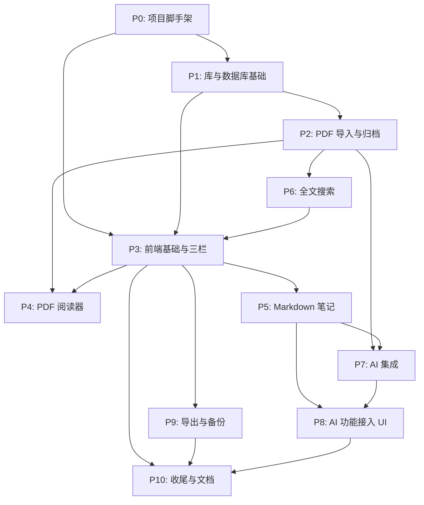

# TASK — PaperVault 原子任务拆分

> 任务代号：`paper-vault`
> 版本：v1.0 — 2026-06-14
> 上游文档：[DESIGN_paper-vault.md](./DESIGN_paper-vault.md) / [CONSENSUS_paper-vault.md](./CONSENSUS_paper-vault.md)

## 一、任务依赖图

## 二、阶段 0：项目脚手架

### T0.1 Tauri + React + TypeScript 初始化
- **输入契约**：
  - 工作目录 `f:/learn/study/ai/trea` 为空
  - Node.js ≥ 18、pnpm ≥ 8、Rust ≥ 1.74 已装
- **输出契约**：
  - `package.json`、`pnpm-lock.yaml`、Vite + React 18 + TS 配置
  - `src-tauri/Cargo.toml`、`tauri.conf.json`、Tauri 2.x
  - `pnpm tauri dev` 能启动空白窗口
- **实现约束**：
  - 包名 `paper-vault`、产品名 `PaperVault`
  - React Router 6、Zustand 装好
  - 关闭 Tauri 默认示例页面
- **依赖**：无

### T0.2 Tailwind + shadcn/ui 接入
- **输入契约**：T0.1 完成
- **输出契约**：
  - Tailwind CSS 配置 + 全局样式
  - shadcn/ui CLI 初始化，`components/ui/` 至少包含 button / dialog / input / table / toast
  - 主题：亮色 + 暗色切换骨架
- **依赖**：T0.1

### T0.3 前端测试与代码规范
- **输入契约**：T0.2 完成
- **输出契约**：
  - `vitest.config.ts`、1 个示例测试通过
  - ESLint + Prettier + tsc strict mode
  - `pnpm lint` `pnpm test` `pnpm typecheck` 全部通过
- **依赖**：T0.2

### T0.4 Rust 项目结构与基础依赖
- **输入契约**：T0.1 完成
- **输出契约**：
  - `src-tauri/src/` 完整模块目录（commands / services / db / vault / pdf / markdown / ai / export / duplicates / seed）
  - `cargo build` 成功
  - `cargo test` 至少 1 个占位测试通过
  - clippy / rustfmt 配置
- **依赖**：T0.1

### T0.5 tauri-plugin-sql 接入与最小迁移
- **输入契约**：T0.4 完成
- **输出契约**：
  - `tauri-plugin-sql` 安装并注册
  - 迁移文件 `migrations/0001_init.sql` 包含所有表
  - `init_vault` 命令能把库目录建好 + 跑迁移
  - dev 模式启动后 SQLite 可读写
- **依赖**：T0.4

## 三、阶段 1：库与数据库基础

### T1.1 Vault 模块（库目录管理）
- **输入契约**：T0.5 完成
- **输出契约**：
  - `vault::create_at(path)`、`vault::info(path)`、`vault::copy_pdf(src, dst)`、`vault::open_in_explorer(path)`
  - 单元测试：创建/复制/路径穿越拒绝
  - 命令 `init_vault` / `get_vault_info` / `open_vault_folder`
- **依赖**：T0.5

### T1.2 Paper CRUD 命令
- **输入契约**：T1.1 完成
- **输出契约**：
  - `services/paper.rs` 实现 list / get / update / delete
  - 命令 `list_papers` / `get_paper` / `update_paper` / `delete_paper`
  - 单测：CRUD + 软删除/硬删除三模式
  - 列表支持 status / tag / collection / keyword 过滤
- **依赖**：T1.1

### T1.3 阅读进度 + 集合 + 标签
- **输入契约**：T1.2 完成
- **输出契约**：
  - `update_progress` 命令
  - 集合 CRUD + 论文关联
  - `list_keywords` / `list_tags` 命令（distinct）
  - 单测：进度 upsert、集合层级
- **依赖**：T1.2

## 四、阶段 2：PDF 导入与归档

### T2.1 PDF 文件复制与命名
- **输入契约**：T1.1 完成
- **输出契约**：
  - `pdf::copy_to_vault(src_path, paper_id, title) -> PathBuf`
  - 命名规则 `{id}-{slug}.pdf`，放 `pdfs/YYYY/`
  - 200MB 限制 + 扩展名白名单
  - 单测：slug 生成、目录创建、路径穿越拒绝
- **依赖**：T1.1

### T2.2 PDF 元数据提取（基础）
- **输入契约**：T2.1 完成
- **输出契约**：
  - 用 `pdf-extract` 抽首页文本
  - 正则提取 DOI、标题（首行启发式）
  - 函数 `pdf::extract_basic(src_path) -> BasicMeta`
  - 单测：典型论文 / 损坏文件 / 无元数据
- **依赖**：T2.1

### T2.3 PDF 文本提取（用于索引）
- **输入契约**：T2.2 完成
- **输出契约**：
  - `pdf::extract_pages(src_path) -> Vec<(page_no, text)>`（分页）
  - 单测：5 页样本 PDF → 5 条记录
  - 失败时不抛错，返回空 Vec + 警告日志
- **依赖**：T2.2

### T2.4 重复检测
- **输入契约**：T1.2 完成
- **输出契约**：
  - `duplicates::detect(meta) -> Vec<DuplicateCandidate>`
  - DOI / 标题归一化 / 作者+年份 三个层级
  - `check_duplicates` 命令
  - 单测：DOI 命中、标题近似、不重复
- **依赖**：T1.2

### T2.5 导入命令（单 + 批）
- **输入契约**：T2.1 + T2.2 + T2.3 + T2.4 完成
- **输出契约**：
  - `import_pdf` / `import_pdfs_batch` 命令
  - 流程：复制 PDF → 抽元数据 → 写 papers 表（status='未读'，title=filename fallback）→ 返回 Paper + 疑似重复
  - 触发后台索引任务（占位即可，T6 阶段接入 FTS5）
  - 单测：成功 / 失败 / 重名处理
- **依赖**：T2.1, T2.2, T2.3, T2.4

### T2.6 删除论文三模式
- **输入契约**：T1.2 完成
- **输出契约**：
  - `delete_paper` 命令支持 `entry` / `entry+pdf` / `entry+pdf+note` 三模式
  - 模式 `entry` 时不动文件
  - 单测：三种模式行为
- **依赖**：T1.2, T2.1（验证文件存在）

## 五、阶段 3：前端基础与三栏布局

### T3.1 IPC 客户端封装 + 类型
- **输入契约**：T1.2 完成（已有命令可调用）
- **输出契约**：
  - `src/lib/api.ts` 包含所有命令的 typed 封装
  - `src/types/` 定义与 Rust 一致的类型
  - 单测：mock invoke 后参数透传
- **依赖**：T1.2

### T3.2 路由 + LibraryShell 三栏
- **输入契约**：T3.1 + T0.2 完成
- **输出契约**：
  - `/library` `/reader/:id` `/settings` 三个路由
  - LibraryShell：左 240 / 中 flex / 右 360 三栏
  - 启动时若未选库 → 弹窗要求选库
  - 启动时若无 `get_vault_info` 成功 → 提示建库
- **依赖**：T3.1, T0.2

### T3.3 CollectionsPane（左侧目录）
- **输入契约**：T3.2 + T1.3 完成
- **输出契约**：
  - 树形集合 + 快捷筛选（未读 / 阅读中 / 已读 / 最近阅读）
  - 新建/重命名/删除集合（弹窗）
  - 选中后更新 store
- **依赖**：T3.2, T1.3

### T3.4 PaperListPane（中间列表）
- **输入契约**：T3.2 + T1.2 + T3.1 完成
- **输出契约**：
  - 顶部：搜索框 + 排序下拉
  - 列表：标题、作者、年份、状态、进度条
  - 分页（50/页，滚动加载）
  - 选中后右侧显示详情
- **依赖**：T3.2, T1.2, T3.1

### T3.5 PaperDetailPane（右侧详情）
- **输入契约**：T3.4 完成
- **输出契约**：
  - 元数据编辑表单（标题/作者/年份/期刊/DOI/摘要/关键词/标签/状态/评分）
  - 集合编辑、标签编辑
  - "打开 PDF" 按钮 → 跳阅读工作台
  - "AI 提取元数据" 按钮（T8 接入）
- **依赖**：T3.4

## 六、阶段 4：PDF 阅读器

### T4.1 pdf.js 集成
- **输入契约**：T0.1 完成
- **输出契约**：
  - `src/lib/pdfjs.ts` worker 配置、Tauri asset protocol 适配
  - PDFViewer 基础组件：渲染单页、缩放、滚动
  - 测试：内置小 PDF 能渲染
- **依赖**：T0.1

### T4.2 阅读器工具栏
- **输入契约**：T4.1 + T3.2 完成
- **输出契约**：
  - ReaderShell：左 PDF 60% / 右 NoteEditor 40%
  - 工具栏：页码输入、上一页/下一页、缩放 +/-、搜索
- **依赖**：T4.1, T3.2

### T4.3 阅读进度自动保存
- **输入契约**：T4.2 + T1.3 完成
- **输出契约**：
  - 切页时 debounce 500ms 调 `update_progress`
  - 关闭前发送最后进度
  - 打开论文时调用 `get_paper` 恢复页码
- **依赖**：T4.2, T1.3

## 七、阶段 5：Markdown 笔记

### T5.1 Markdown 模块（frontmatter）
- **输入契约**：T0.4 完成
- **输出契约**：
  - `markdown::read_note(path) -> NoteContent { frontmatter, body }`
  - `markdown::write_note(path, content)` 保留 frontmatter 风格
  - `markdown::update_ai_block(path, block_name, new_content)` 安全替换
  - 单测：frontmatter 解析、AI 区块替换
- **依赖**：T0.4

### T5.2 默认笔记模板
- **输入契约**：T5.1 完成
- **输出契约**：
  - `markdown::default_template(paper_meta) -> String`
  - 模板内容与 CONSENSUS 一致
  - 单测：模板生成、字段填充
- **依赖**：T5.1

### T5.3 笔记 CRUD 命令
- **输入契约**：T5.2 + T1.2 完成
- **输出契约**：
  - `create_note`（写默认模板到 `notes/papers/`）
  - `get_note` / `update_note` / `update_note_ai_block`
  - `import_note`（复制外部 md、frontmatter 合并策略：DB 优先）
  - 单测：CRUD、AI 区块更新、冲突策略
- **依赖**：T5.2, T1.2

### T5.4 CodeMirror 编辑器组件
- **输入契约**：T0.2 完成
- **输出契约**：
  - `components/notes/CodeMirrorEditor.tsx` 包装 CodeMirror 6
  - 支持 Markdown 语法高亮、暗色主题、只读切换
  - 受控 value + onChange
- **依赖**：T0.2

### T5.5 NoteEditor 集成到 ReaderShell
- **输入契约**：T4.2 + T5.3 + T5.4 完成
- **输出契约**：
  - 右侧加载论文笔记
  - 自动保存（debounce 1s）调 `update_note`
  - 顶部"AI 摘要" / "AI 总结" / "翻译摘要" 三个按钮（T8 接入）
- **依赖**：T4.2, T5.3, T5.4

### T5.6 导入已有 Markdown
- **输入契约**：T5.3 完成
- **输出契约**：
  - `import_note` 端到端：选文件 → 复制到 `notes/papers/` → 解析 frontmatter → 与 DB 比对
  - 冲突时返回 `noteImportPreview`，前端弹窗让用户选择
- **依赖**：T5.3

## 八、阶段 6：全文搜索

### T6.1 FTS5 schema + 索引 CRUD
- **输入契约**：T0.5 完成
- **输出契约**：
  - `fulltext_index` 虚拟表创建
  - `index_status` 表
  - `services/index.rs`：upsert_index / delete_index / reindex_paper
  - 单测：插入 / 查询 / 删除
- **依赖**：T0.5

### T6.2 后台索引器
- **输入契约**：T6.1 + T2.3 完成
- **输出契约**：
  - `tokio::spawn` 任务，`PdfIndexJob { paper_id, pdf_path }`
  - 流程：抽文本 → 写 FTS5（title/authors/abstract/keywords/notes/pdf 分段）→ 写 status
  - 1 并发 + 队列
  - `reindex_paper` / `reindex_all` 命令
  - 单测：job 入队 / 状态机
- **依赖**：T6.1, T2.3

### T6.3 搜索命令 + 权重排序
- **输入契约**：T6.1 完成
- **输出契约**：
  - `search(query, scopes?)` 命令
  - 权重：title=10 / authors=8 / doi=8 / keywords=6 / abstract=4 / notes=3 / pdf=1
  - 同级排序：last_read_at desc → updated_at desc → year desc
  - snippet 高亮 ±40 字
  - 单测：典型 query、scope 过滤
- **依赖**：T6.1

### T6.4 搜索 UI
- **输入契约**：T6.3 + T3.4 完成
- **输出契约**：
  - 顶部搜索框（CommandK 风格，可选）
  - 搜索结果按论文分组，命中行高亮
  - 点击 PDF 命中 → 跳到对应页
- **依赖**：T6.3, T3.4

## 九、阶段 7：AI 集成

### T7.1 AI Provider 配置
- **输入契约**：T0.5 完成
- **输出契约**：
  - `ai_provider_config` 表读写
  - `get_ai_config` / `update_ai_config` 命令
  - 单测：读写、key 隐藏（仅前 4 后 4 字符返回）
- **依赖**：T0.5

### T7.2 OpenAI 兼容客户端
- **输入契约**：T7.1 完成
- **输出契约**：
  - `ai::client::chat(config, messages, json_mode) -> String`
  - 支持 base_url、model、api_key
  - 错误分类：401/429/500/network
  - 单测：mock reqwest
- **依赖**：T7.1

### T7.3 内置 7 个 AI 预设
- **输入契约**：T0.5 + T7.2 完成
- **输出契约**：
  - 启动时 seed：`metadata_from_pdf` / `abstract_translate` / `paper_summary` / `create_reading_note` / `related_papers_lookup` / `topic_literature_review` / `citation_check`
  - `ai_skill_presets` 表 `is_builtin=1`
  - 单测：seed 幂等、名称唯一
- **依赖**：T0.5, T7.2

### T7.4 预设 CRUD + 用户自定义
- **输入契约**：T7.3 完成
- **输出契约**：
  - `get_ai_presets` / `update_ai_preset` / `reset_ai_preset`
  - 用户修改 → 写入同 bound_action 的非 builtin 行，原 builtin 不动
  - reset → 删除用户版，builtin 仍可读
  - 单测：覆盖、reset、边界
- **依赖**：T7.3

### T7.5 提示词模板引擎
- **输入契约**：T7.4 完成
- **输出契约**：
  - `ai::template::render(user_template, vars) -> String`
  - 变量替换：`{{title}}` `{{abstract}}` `{{doi}}` 等
  - 单测：变量、缺失变量报错
- **依赖**：T7.4

### T7.6 运行 AI 命令
- **输入契约**：T7.2 + T7.5 + T1.2 完成
- **输出契约**：
  - `run_ai({ presetId, paperId?, input })` 命令
  - 流程：取 preset → 准备 vars → 渲染 → 调客户端 → 解析输出（json/markdown）→ 返回 AIResult
  - 不自动写库，由 UI 决定是否落盘
  - 单测：mock 客户端
- **依赖**：T7.2, T7.5, T1.2

## 十、阶段 8：AI 功能接入 UI

### T8.1 元数据提取
- **输入契约**：T7.6 + T2.5 + T3.5 完成
- **输出契约**：
  - PaperDetailPane 点击"AI 提取元数据" → 调 `run_ai(preset=metadata_from_pdf)`
  - 候选弹窗显示 → 用户确认 → `update_paper`
  - 同步更新 frontmatter
- **依赖**：T7.6, T2.5, T3.5

### T8.2 总结 / 翻译 / 自动建笔记
- **输入契约**：T7.6 + T5.5 完成
- **输出契约**：
  - NoteEditor 顶部三按钮：总结 / 翻译 / 建笔记
  - "建笔记"：若不存在 → T5.3 写默认模板 → 调 summary preset → 写 AI 区块
  - "总结"：仅写 `<!-- AI_GENERATED_START:key_points -->` 区块
  - "翻译"：仅写 `<!-- AI_GENERATED_START:summary -->` 区块
  - 单测：流程、边界
- **依赖**：T7.6, T5.5

### T8.3 设置页：AI 配置 + 预设管理
- **输入契约**：T7.1 + T7.4 完成
- **输出契约**：
  - `/settings` 三个 Tab：AI 配置 / 预设管理 / 库管理
  - AI 配置：base_url / api_key（密码框） / model，保存调 `update_ai_config`
  - 预设管理：列表 → 编辑 system / user prompt / 名称 / 输出格式 / 是否自动写
  - "恢复默认" 按钮
- **依赖**：T7.1, T7.4

## 十一、阶段 9：导出与备份

### T9.1 BibTeX 导出
- **输入契约**：T1.2 完成
- **输出契约**：
  - `export::bibtex::render(papers) -> String`
  - entry type 自动选择（article / inproceedings / misc）
  - 字段缺失给空不报错
  - `export_bibtex` 命令
  - 前端：选中论文 → 导出按钮 → 复制到剪贴板 / 保存到 `exports/`
  - 单测：各 entry type、特殊字符转义
- **依赖**：T1.2

### T9.2 Markdown 引用导出
- **输入契约**：T1.2 完成
- **输出契约**：
  - `export::citation::render(papers) -> String`
  - 格式 `- {firstAuthor}, {year}, {title}, DOI:{doi}`
  - `export_markdown_citation` 命令
  - 单测：作者截断、字段缺失
- **依赖**：T1.2

### T9.3 打开库目录 + 数据库备份
- **输入契约**：T1.1 完成
- **输出契约**：
  - `open_vault_folder` 命令
  - `backup_database` 命令：复制 db 到 `backups/papers-YYYYMMDD-HHMMSS.db`
  - 前端设置页：两个按钮
  - 单测：备份命名、时间戳格式
- **依赖**：T1.1

## 十二、阶段 10：收尾与文档

### T10.1 示例数据 Seed
- **输入契约**：T1.2 + T5.3 完成
- **输出契约**：
  - `seed::load_examples()` 写 3-5 篇占位 Paper
  - 无真实 PDF（pdf_path 留空或放占位文件）
  - 状态：1 篇已读、2 篇阅读中、2 篇未读
  - 含 2-3 个集合、若干标签
  - `load_seed_data` 命令
  - 启动时若无数据 + 用户选"演示模式" → 触发
- **依赖**：T1.2, T5.3

### T10.2 全局体验打磨
- **输入契约**：T3.x + T4.x + T5.x + T8.x 完成
- **输出契约**：
  - Toast 统一封装（成功 / 错误 / 警告）
  - 加载状态、空状态、错误边界
  - 暗色主题优化
  - 关键交互：删除二次确认、长操作进度
- **依赖**：T3.5, T4.2, T5.5, T8.1

### T10.3 README + .env.example
- **输入契约**：所有功能完成
- **输出契约**：
  - README.md：项目介绍、技术栈、快速开始、库目录说明、v1 范围
  - .env.example：所有可配置项
  - LICENSE（如适用）
- **依赖**：T10.2

### T10.4 验收与冒烟
- **输入契约**：T10.3 完成
- **输出契约**：
  - 按 [CONSENSUS §五](./CONSENSUS_paper-vault.md#五验收标准) 15 项功能走查
  - `pnpm lint` `pnpm test` `pnpm typecheck` `cargo test` 全部通过
  - `pnpm tauri dev` 启动正常
  - 写 `ACCEPTANCE_paper-vault.md` 记录结果
- **依赖**：T10.3

## 十三、任务汇总

| ID | 任务 | 阶段 | 估时 | 依赖 |
|---|---|---|---|---|
| T0.1 | Tauri+React+TS 初始化 | P0 | 0.5d | - |
| T0.2 | Tailwind + shadcn/ui | P0 | 0.5d | T0.1 |
| T0.3 | 前端测试规范 | P0 | 0.3d | T0.2 |
| T0.4 | Rust 项目结构 | P0 | 0.3d | T0.1 |
| T0.5 | tauri-plugin-sql + 迁移 | P0 | 0.5d | T0.4 |
| T1.1 | Vault 模块 | P1 | 0.5d | T0.5 |
| T1.2 | Paper CRUD | P1 | 0.5d | T1.1 |
| T1.3 | 进度/集合/标签 | P1 | 0.4d | T1.2 |
| T2.1 | PDF 复制 | P2 | 0.3d | T1.1 |
| T2.2 | PDF 元数据基础 | P2 | 0.4d | T2.1 |
| T2.3 | PDF 文本提取 | P2 | 0.3d | T2.2 |
| T2.4 | 重复检测 | P2 | 0.4d | T1.2 |
| T2.5 | 导入命令 | P2 | 0.4d | T2.1-4 |
| T2.6 | 删除三模式 | P2 | 0.2d | T1.2, T2.1 |
| T3.1 | IPC 封装 | P3 | 0.3d | T1.2 |
| T3.2 | 路由+LibraryShell | P3 | 0.5d | T3.1, T0.2 |
| T3.3 | CollectionsPane | P3 | 0.4d | T3.2, T1.3 |
| T3.4 | PaperListPane | P3 | 0.5d | T3.2, T1.2 |
| T3.5 | PaperDetailPane | P3 | 0.5d | T3.4 |
| T4.1 | pdf.js 集成 | P4 | 0.4d | T0.1 |
| T4.2 | 阅读器工具栏 | P4 | 0.4d | T4.1, T3.2 |
| T4.3 | 阅读进度自动存 | P4 | 0.3d | T4.2, T1.3 |
| T5.1 | Markdown 模块 | P5 | 0.4d | T0.4 |
| T5.2 | 默认模板 | P5 | 0.2d | T5.1 |
| T5.3 | 笔记 CRUD 命令 | P5 | 0.4d | T5.2, T1.2 |
| T5.4 | CodeMirror 组件 | P5 | 0.4d | T0.2 |
| T5.5 | NoteEditor 集成 | P5 | 0.4d | T4.2, T5.3, T5.4 |
| T5.6 | 导入已有 md | P5 | 0.3d | T5.3 |
| T6.1 | FTS5 schema | P6 | 0.3d | T0.5 |
| T6.2 | 后台索引器 | P6 | 0.5d | T6.1, T2.3 |
| T6.3 | 搜索命令+权重 | P6 | 0.4d | T6.1 |
| T6.4 | 搜索 UI | P6 | 0.3d | T6.3, T3.4 |
| T7.1 | AI Provider 配置 | P7 | 0.3d | T0.5 |
| T7.2 | OpenAI 客户端 | P7 | 0.4d | T7.1 |
| T7.3 | 7 个内置预设 | P7 | 0.3d | T0.5, T7.2 |
| T7.4 | 预设 CRUD | P7 | 0.4d | T7.3 |
| T7.5 | 模板引擎 | P7 | 0.2d | T7.4 |
| T7.6 | run_ai 命令 | P7 | 0.4d | T7.2, T7.5, T1.2 |
| T8.1 | 元数据 AI 接入 | P8 | 0.4d | T7.6, T2.5, T3.5 |
| T8.2 | 总结/翻译/建笔记 | P8 | 0.4d | T7.6, T5.5 |
| T8.3 | 设置页 AI 管理 | P8 | 0.5d | T7.1, T7.4 |
| T9.1 | BibTeX 导出 | P9 | 0.3d | T1.2 |
| T9.2 | Markdown 引用 | P9 | 0.2d | T1.2 |
| T9.3 | 打开库+备份 | P9 | 0.2d | T1.1 |
| T10.1 | 示例数据 | P10 | 0.3d | T1.2, T5.3 |
| T10.2 | 全局体验 | P10 | 0.3d | T3-8 |
| T10.3 | README + .env | P10 | 0.2d | T10.2 |
| T10.4 | 验收 | P10 | 0.3d | T10.3 |

合计约 **16 人天**（单人串行 ~3-4 周）

## 十四、关键原则

1. **每完成一个任务立刻验证**（build / test / 手动跑）
2. **依赖未满足不开工**
3. **任何不确定立刻中断询问**
4. **保持每个 commit 可运行**
5. **遇到阻塞回退到上一稳定状态**
